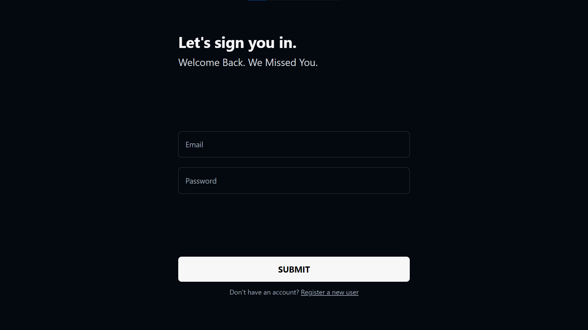
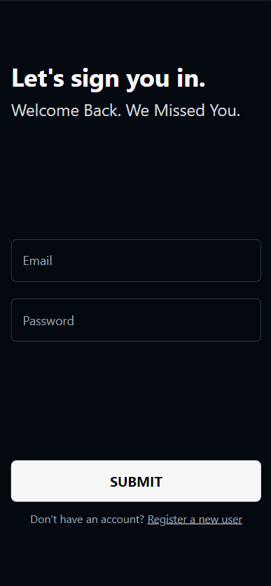
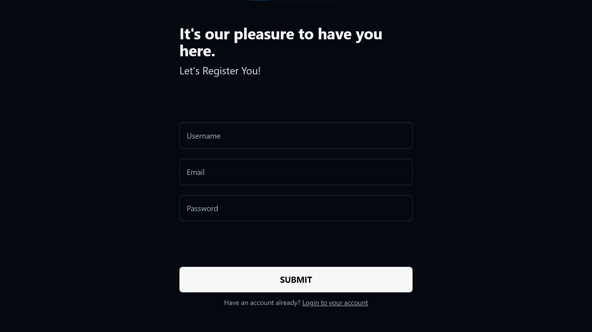
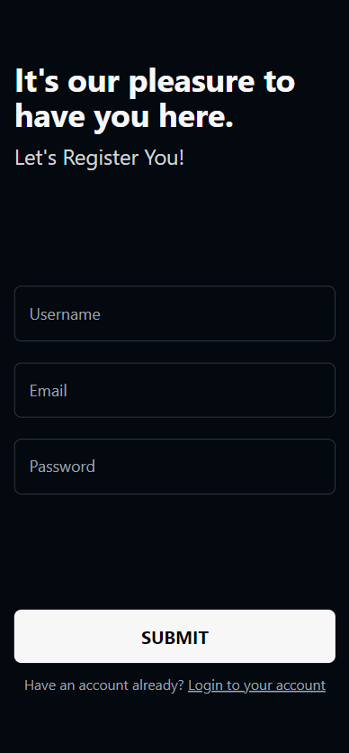
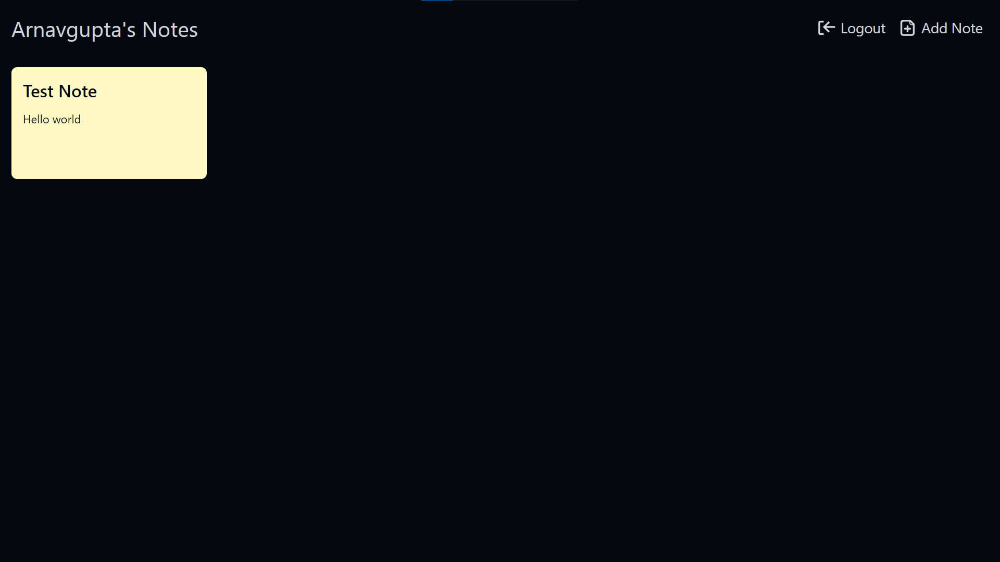
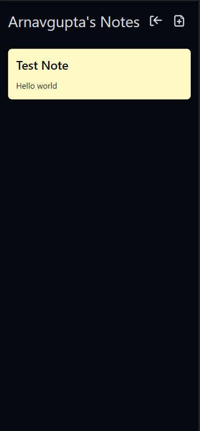
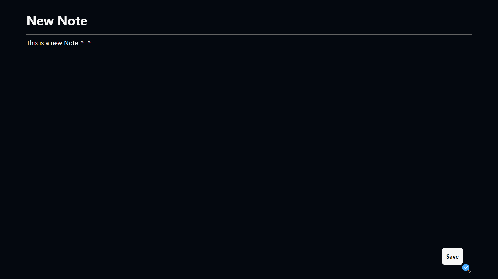
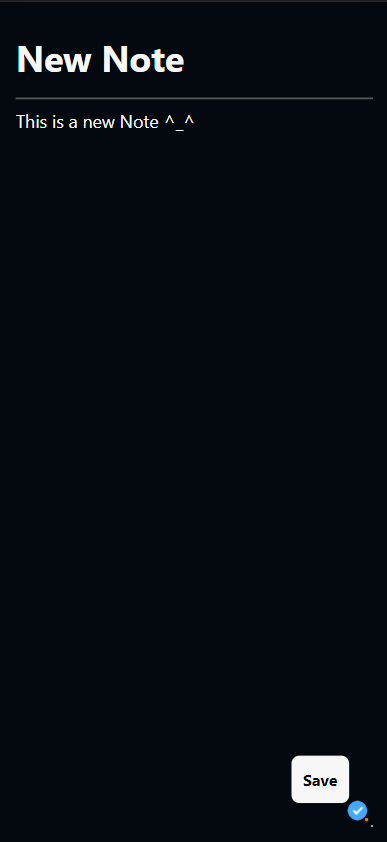

# Fullstack Notes App
My first attempt at solo-building a full-stack MERN web application which suppports features like user authentication and profiles and responsive design. I have followed mobile-first development methodology to develop this project.

## Technologies Used
1. Frontend
    - React.js
    - Tailwind CSS
    - Context API
2. Backend
   - Express.js
   - Passport.js
   - Mongo DB

## App Screenshots

- Login Page

- Register Page

- Dashboard Page

- New Note Page

## Note
This project is not maintained by me due to which, there might be certain issues that arise later on if you clone this project. 